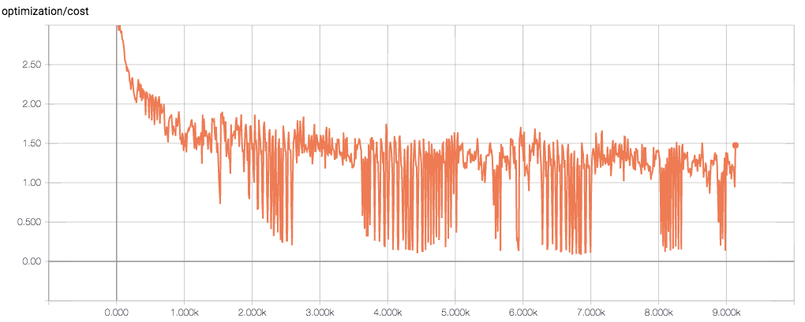
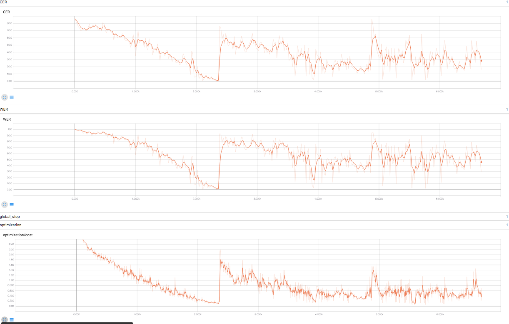
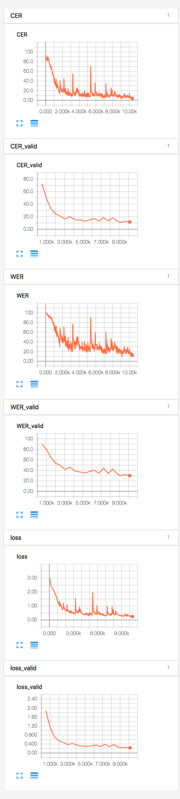

## Before 6 June

I extracted features from I adapted a basic bidirectional LSTM model in tensorflow for the speech recognition task.

## 6 June

Experiment with WER

## 7 June

Fixed many of the bugs involved in the model. Now, I can successfully build the model. There is still some problem for the input, and it took much of my 2-3 days to fix many small bugs in the code, and make it compile. Expecting to find WER of the current basic attention based model by tomorrow.

## 8 June

Finally got my model to work after fixing so many bugs. Currently, it is single layer bidirectional attention based LSTM. I plan to experiment with complex models now.

## 10 June

Add code for checkpointing the weights and fix many things including WER

# 11-12 June

Made the training and evaluation script to run on the cloud. After training for more than 24 hours using GPU, I think the model has still not converged. I am getting WER of around 94% and CER of 72%. I think I need to use beam search instead of greedy search to improve the results. Also attaching the loss over time

# 13 June

Completely relook the architecture, and change many things. Used many bidirectional layers, and used pooling between those. Also made many corrections like logging CER and WER over time. Running the architecture is currently in progress.

# 14 - 15 June

I added beam search decoder instead of the greedy decoder which was present. Beam search is present is still unreleased tensorflow 1.2, and it changes many of the API is seq2seq. Still, I cannot get a better WER. I am currently experimenting with incrementally increasing the maximum length of the output, as I think the model has some trouble learning the alignments.

# 15 June

Finally found the mistake after debugging for so long. I was using targets aligned directly to the logits, and so tensorflow just predicts the same character. The right way to do is to shift targets one place right. I expect to get results with good error rates now.

# 16 June

I ran the code with all the data as training with maximum length 50 at start before running till 150. The sharp peak is where I changed the dataset. It can completely learn(by overfitting) the smaller dataset. At least the model seems to be working.

Try to modularize codebase and make script based interface. Still not working.

# 18 - 19 June

Add proper strides in the encoding layer, and changed many small things. Also, the script is fully working now. Using script is more natural as I can just tweak the parameters by command line. Also, I did many other experiments and I could get around 35% WER and 10% CER in the evaluation set. I had not got a plot as there were many workarounds just to run the code. This is now fixed and I could now get plot for both training and validation data separately. I can attach the latest results by tomorrow.

# 21 - 22 June

Experimented with many options for training. Default options seems to give 30-40% WER, and 10-20% CER. The measurements are quite noisy for these measures between epochs. Training WER can get as low as 10%, so I plan to using wsj1 dataset too. On the code side there is not much progress, as the training time of the models are quite long, around 1 hours per epoch in GPU.

Also read many research papers in this time.

# 23 June

Added per file features normalization.

# 24 June

Added per speaker normalization and changed to using mel filterbank coefficients.

# 25 June

Started work on language model. Also I am getting 29.77% WER and 12.73 CER using the latest code.

# 26 June - 30 June

Stuck in some very fundamental problems with implementing LMs. I planned to use word based LM, but in doing so I need to iterate over every word and update probabilty for the word DAG every time it selects a space, and then in the beam search I have to store the current node for every beam, and adjust the probabilty score accordingly. It's too overwhelming to do that inside tensorflow. I can always move entire thing to plain python, but it will be too much back and forth movement as I need to store the state of RNNs every time model predicts next character.

That's why I am now starting with character based language model. As much I looked in other people's work, they are comparable in perplexity to trigram LMs. Best LM models seems to use embeded word based RNNs, which are equally difficult to use. The code is just for the progress and is not working.

# 1 July - 3 July

Made progress in language model. The model is still not working. I think I will have a working code and results in a day or two. Much of the thought in the model is done, the remaining part is to train a model and then use pre-trained model from then in the acoustic model's inference part.
